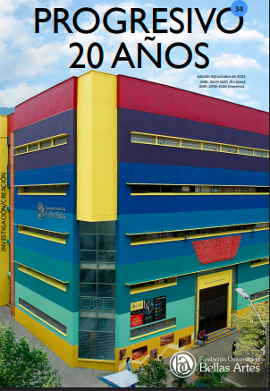

# Progresivo — Rediseño web de revista universitaria

Sitio web desarrollado para **Progresivo**, la revista de investigación y creación de la Fundación Universitaria Bellas Artes (Medellín). Propuesta de rediseño para modernizar la presencia digital de la revista y facilitar el acceso a sus ediciones y artículos de archivo.

🔗 **Demo en vivo:** [pogresivo-revista.vercel.app](https://pogresivo-revista.vercel.app)



## El problema

La versión anterior del sitio se veía anticuada y poco profesional, algo que no representaba bien el nivel del contenido académico y creativo que publica la revista. Nadie me pidió el rediseño ni me dio un brief: identifiqué el problema por mi cuenta y decidí proponer una solución completa.

## Qué hace

- Catálogo de todas las ediciones publicadas, con **filtros por año y por ISSN**
- Visor y descarga directa de cada edición en PDF
- Sección de **Archivo** con artículos individuales de investigación y creación (música, artes visuales, fotografía, audiovisual)
- Página de identidad de marca de la revista y página de convocatorias
- Totalmente responsive

## Stack

HTML5 semántico, CSS3, JavaScript vanilla (sin frameworks). Desplegado en Vercel.

## Decisiones técnicas

- **Sitio multi-página en vez de SPA:** cada sección (archivo, convocatorias, identidad, cada artículo) es su propio HTML. Para un sitio de contenido mayormente estático como este, evita la complejidad de un framework y mantiene el SEO y los tiempos de carga simples.
- **Filtrado en el cliente con JavaScript vanilla:** los filtros de año e ISSN se resuelven sin recargar la página ni depender de un backend, manipulando directamente el DOM sobre los datos de las ediciones.
- **Los PDFs se sirven como archivos estáticos** desde `/PdfRevistas`, permitiendo tanto lectura en línea como descarga directa sin necesidad de un visor externo.

## Estructura del proyecto

```
├── index.html                  # Home: destacado, catálogo con filtros
├── archivo-*.html               # Artículos individuales de archivo
├── convocatorias.html
├── identidad.html
├── css/
├── js/
├── img/
└── PdfRevistas/                 # Ediciones en PDF
```

## Cómo correrlo localmente

Al ser HTML/CSS/JS puro, no requiere instalación de dependencias:

```bash
git clone https://github.com/Candro25/Pogresivo-Revista.git
cd Pogresivo-Revista
# abrir index.html con Live Server (VS Code) o cualquier servidor estático
```

## Qué aprendí construyéndolo

- Organizar un sitio multi-página manteniendo consistencia visual y de navegación entre todas las secciones
- Implementar lógica de filtrado en JavaScript puro sin librerías
- Trabajar con activos pesados (PDFs, imágenes de portada) sin frameworks de optimización

## Qué mejoraría con más tiempo

- Lazy loading de imágenes de portadas, ya que el catálogo crece con cada edición
- Migrar el filtrado a un pequeño estado centralizado para que sea más fácil añadir nuevos filtros (autor, categoría)
- Mejorar accesibilidad: roles ARIA en el sistema de filtros y navegación por teclado
